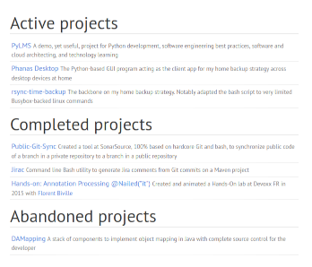

# Fork of Elegant – an elegant theme for Pelican

This is a fork of the [Elegant](https://github.com/Pelican-Elegant/elegant) theme for the static site generator [Pelican](https://getpelican.com/).

# Why a fork

* last change to the original repository is 2 years old and the [GitHub projects](https://github.com/Pelican-Elegant/elegant/milestones) from 2020 have not been completed.
* I want to customize the theme's code to my needs

The original README of the project is: [ORIGINAL_README.md](ORIGINAL_README.md)

# Changes since the fork

* search field uses Google search with filter `site:[SITEURL]`
* multiple projects blocks can be added to the landing page

    

    * variable `PROJECTS` structure has been changed (see [doc in _defaults.html](templates/_includes/_defaults.html#L165-L181))
    * `PROJECTS_TITLE` variable has been dropped
* footer links to this repository rather than the original project

# License

Unchanged from the original project: [MIT license](https://spdx.org/licenses/MIT.html).

